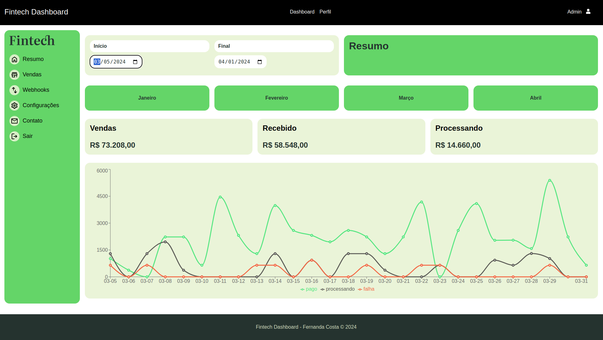
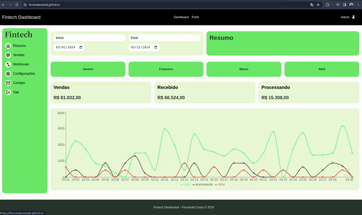
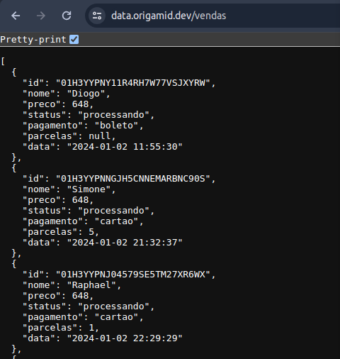
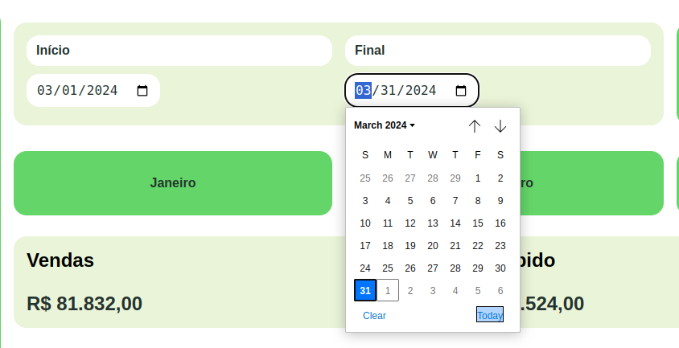
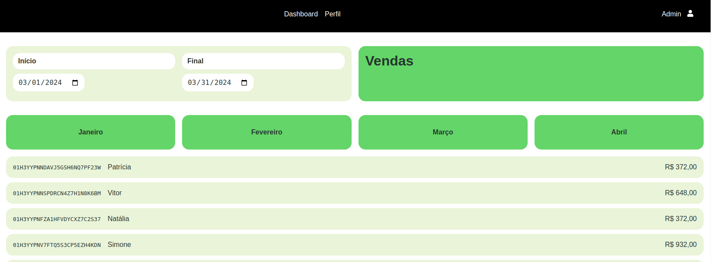
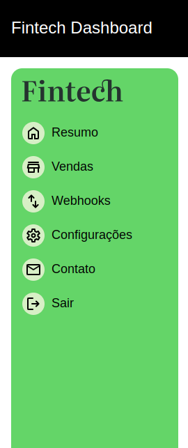
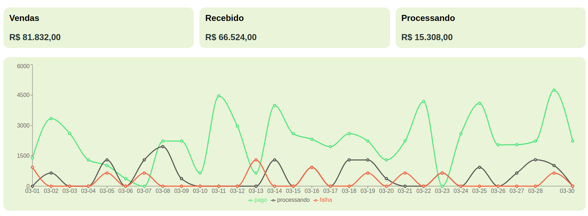

# 

# Fintech: Dashboard para Análise de Vendas

<table>
<tr>
<td>
 Fintech é uma solução de visualização de dados projetada para análise e monitoramento de vendas. É um Dashboard dinâmico e intuitiva que oferece uma visão geral e em tempo real das transações comerciais, fornecendo insights valiosos para empresas e profissionais do setor financeiro.
</td>
</tr>
</table>

## Demo

Aqui está uma demonstração funcional: https://fernandacostads.github.io/fintech/

### Integração com API de Vendas

Os dados são da API da ORIGAMID e seguem como mostrado na imagem.
# 

### Filtro de venda

### Lista de vendas por período e mês

### Sidebar

### Gráficos

Os gráficos foram desenvolvidos a partir da lib Recharts.
https://github.com/recharts/recharts

## Desenvolvido com:

- [React - Vite](https://vitejs.dev/) - Utilizei o Vite para criar uma aplicação React com TypeScript.
- [NPM](https://npmjs.com) - Node package manager (npm).
- [Recharts](https://github.com/recharts/recharts) - Lib para criar gráficos usando Typescript.                                                                           |

